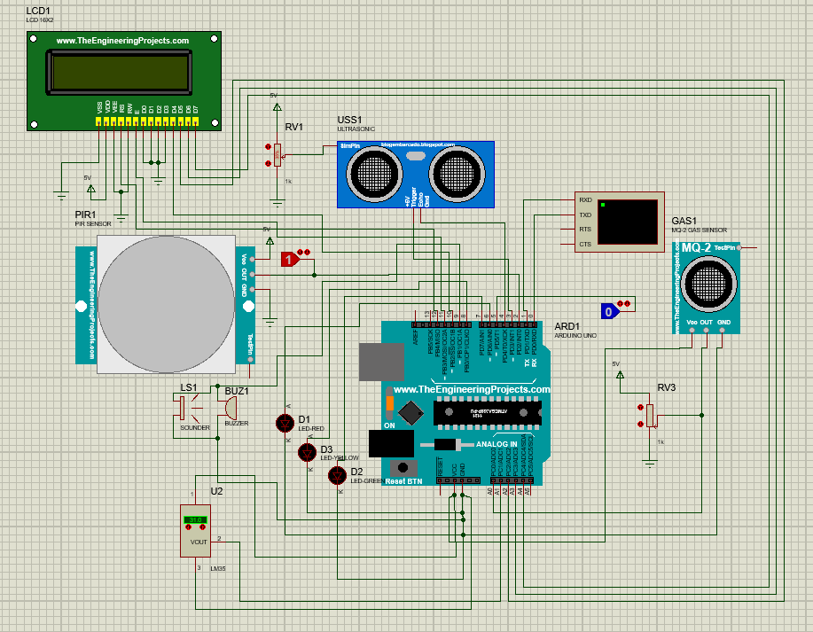

Generated markdown
<p align="left">
  <a href="https://www.cplusplus.com/" target="_blank">
    
  </a>
  <a href="https://www.arduino.cc/" target="_blank">
    
  </a>
  <a href="https://www.labcenter.com/" target="_blank">
    
  </a>
  <a href="https://github.com/vikramvkm/Safesense360/blob/main/LICENSE">
    
  </a>
</p>

# Safesense360: Intelligent Room Safety & Monitoring System

A robust, multi-sensor safety system engineered to provide a reliable safety solution for enclosed spaces. This project integrates an Arduino Uno with a suite of sensors to create a layered, priority-driven alert hierarchy for fire, gas, and high temperatures, while also intelligently monitoring for human presence.

---

## 🎥 Project Demonstration


## ✨ Key Features

-   **Multi-Hazard Detection:** Simultaneously monitors for fire, high temperatures, and combustible gas leaks in real-time.
-   **Priority-Based Alert System:** Implements a fail-safe logic where critical alerts (like fire) always override lower-priority warnings, ensuring the most severe threat gets immediate attention.
-   **Intelligent Scenario Analysis:** A unique safety feature that combines data from the gas, motion, and ultrasonic sensors. If a gas leak is detected with no motion, the system escalates the alarm to signify a more urgent situation.
-   **Multi-Modal Feedback:** Provides clear and comprehensive feedback through:
    -   A **16x2 LCD Display** for detailed status messages.
    -   **Red, Yellow, and Green LEDs** for at-a-glance status checks (Danger, Warning, Safe).
    -   A **Piezo Buzzer** with distinct alarm patterns for different threat levels.
-   **Real-time Status Monitoring:** Continuously provides the room's status, from "System Standby" and "Area Clear" to "All Safe" and "Area Occupied."

## 🛠️ Hardware & Software Stack

| Component                | Description                                                |
| ------------------------ | ---------------------------------------------------------- |
| **Microcontroller**      | Arduino Uno                                                |
| **Sensors**              | PIR Motion, HC-SR04 Ultrasonic, MQ-2 Gas, LM35 Temperature |
| **Actuators**            | Red, Yellow, Green LEDs; Piezo Buzzer                      |
| **Display**              | 16x2 I2C LCD Display                                       |
| **Simulation Software**  | Proteus Design Suite                                       |
| **Development IDE**      | Arduino IDE                                                |

## 🔌 Circuit Diagram

<!-- The circuit diagram is hidden until the PNG file is added to the 'assets' folder -->
<!--  -->

*The complete Proteus simulation file can be found in the `/simulation` directory.*

## 🧠 System Logic & Priority Flow

The system's core logic is built on a strict priority hierarchy to ensure that alerts are handled in order of severity.
Use code with caution.
Markdown
START LOOP
│
├─> [Read All Sensor Data] (PIR, Fire, Gas, Temp, Ultrasonic)
│
├─> [Check Priority 1: FIRE SWITCH]
│ ├─ (YES) -> Trigger FIRE ALARM (Red LED + Continuous Buzzer) -> END OF CHECK
│ └─ (NO) --> [Check Priority 2: HIGH TEMPERATURE]
│ ├─ (YES) -> Trigger HIGH TEMP ALARM (Red LED + Beeping Buzzer) -> END OF CHECK
│ └─ (NO) --> [Check Priority 3: GAS LEAK]
│ ├─ (YES) -> [Check CRITICAL SUB-CASE: "Person in Danger?"]
│ │ ├─ (YES: No Motion) -> Trigger CRITICAL ALARM (Red LED / Continuous Buzzer) -> END OF CHECK
│ │ └─ (NO) -> Trigger STANDARD WARNING (Yellow LED + Beeping Buzzer) -> END OF CHECK
│ └─ (NO) --> [Check Priority 4: MOTION DETECTED]
│ ├─ (YES) -> Set SAFE State (Blinking Green LED) -> END OF CHECK
│ └─ (NO) --> [Set STANDBY State] (All off) -> END OF CHECK
│
└─> Delay & REPEAT
Generated code
## ⚙️ Installation & Setup

1.  **Clone the Repository:**
    ```bash
    git clone https://github.com/vikramvkm/Safesense360.git
    ```

2.  **Hardware Setup:**
    -   Assemble the circuit on a breadboard based on the schematics in the Proteus file.
    -   Ensure all components are powered correctly (5V and GND).

3.  **Simulation Setup (Proteus):**
    -   Open the `safesense360.pdsprj` file from the `/simulation` directory in Proteus.
    -   The Arduino component must be loaded with the compiled `.hex` file. To do this:
        1. Open the `.ino` file from the `/firmware` directory in the Arduino IDE.
        2. Go to `Sketch > Export Compiled Binary`.
        3. In Proteus, double-click the Arduino and set the "Program File" to the `.hex` file that was just created inside the `/firmware` folder.

4.  **Software Setup:**
    -   Open the `.ino` file in the Arduino IDE.
    -   Install the required `LiquidCrystal` library from the Library Manager if needed.
    -   Connect your Arduino Uno, select the correct Board and Port from the `Tools` menu, and click **Upload**.

## 🚀 How to Use & Test the System

You can test the full range of system functionality by simulating different environmental conditions:

| State               | Simulation Steps                                                                                   | Expected Outcome                                                                  |
| ------------------- | -------------------------------------------------------------------------------------------------- | --------------------------------------------------------------------------------- |
| **Standby**         | PIR TestPin=0, Fire Switch=0, Temp < 48°C, Gas Potentiometer low.                                    | All LEDs & buzzer OFF. LCD: "SYSTEM STANDBY".                                     |
| **Safe & Occupied** | Set PIR TestPin=1. All other conditions are safe.                                                  | Green LED blinks. LCD: "STATUS: ALL SAFE".                                        |
| **Gas Leak Warning**| Increase the Gas Sensor potentiometer (RV3) until the value in the Virtual Terminal exceeds 200.     | Yellow LED ON, buzzer beeps. LCD: "GAS LEAK WARNING".                             |
| **High Temp Alert** | Increase the temperature on the LM35 component to > 48.0°C.                                        | Red LED ON, buzzer beeps differently. LCD: "DANGER: HIGH TEMP". (Overrides Gas)    |
| **Fire Emergency**  | Set the Fire Switch (Logic State on Pin 5) to 1.                                                   | Red LED ON solid, buzzer is a continuous siren. LCD: "!!FIRE EMERGENCY!!". (Highest Priority) |

## 💡 Future Enhancements

This project serves as a strong foundation for an even more advanced system. Future improvements could include:

-   **IoT Integration:** Use an ESP8266 or ESP32 to send push notifications to a smartphone via Wi-Fi during an alert.
-   **Data Logging:** Add an SD card module to log sensor data over time, which can be useful for analysis.
-   **Power Backup:** Implement a battery backup system to ensure the device remains operational during a power outage.
-   **Automatic Response:** Integrate relays to automatically shut off a gas valve or activate a ventilation fan during an emergency.

## 📜 License

This project is licensed under the MIT License - see the [LICENSE](LICENSE) file for details.

---
*This project was developed as a comprehensive solution for real-time environmental safety monitoring. Feel free to fork, improve, and use it!*
